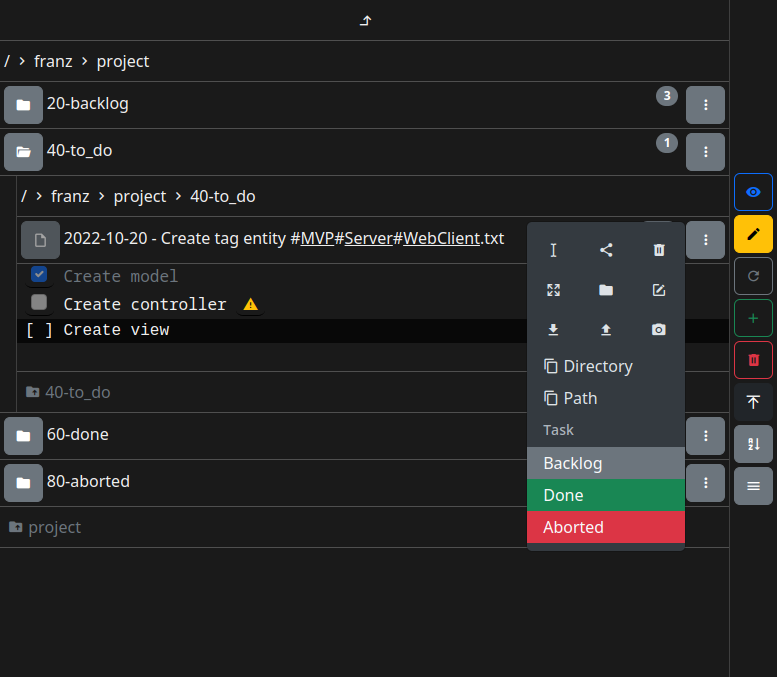

# FileAdmin - Web Client

FileAdmin is a web-based, mobile-first file manager.
It serves your already existing file structure.
One server instance runs per user, while file system permissions limit access.
It also features a task management system and tag-based file system that parses tags from file names and optionally from file contents.

This project only contains web client code.
For the corresponding server project see [fileadmin-server](https://github.com/franzmandl/fileadmin-server).
This project was bootstrapped with [Create React App](https://github.com/facebook/create-react-app).



## Set up

```shell
npm install
```

## Run in Development Mode

```shell
npm run start
```

Listens on port [3000](http://localhost:3000/).

## Test

```shell
CI=true npm run test
```

## Build for Production

```shell
npm run build
```

## Deploy

```shell
mkdir -p /opt/fileadmin/web
rsync -aiv --delete ./build/ /opt/fileadmin/web
```

## Run in Production Mode

Files in `/opt/fileadmin/web` should be served by FileAdmin production server.
